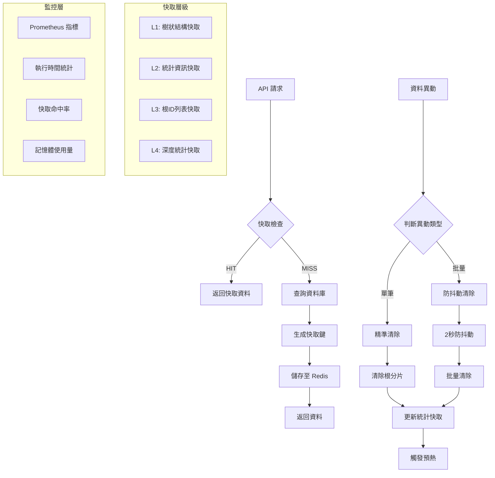

# 商品分類模組技術文檔

## 📋 目錄

- [概述](#概述)
- [系統架構](#系統架構)
- [Cache Flow 架構圖](#cache-flow-架構圖)
- [API 端點](#api-端點)
- [資料庫結構](#資料庫結構)
- [快取策略](#快取策略)
- [效能監控](#效能監控)
- [測試資料生成](#測試資料生成)
- [部署指南](#部署指南)
- [最佳實踐](#最佳實踐)

## 概述

商品分類模組是一個企業級的階層式分類系統，支援無限層級的樹狀結構，提供完整的 CRUD 操作、高效快取機制、及豐富的 API 功能。

### 核心特性

- **🌳 階層式結構**：支援無限層級的樹狀分類
- **⚡ 高效快取**：Redis 標籤式快取 + 根分片策略
- **📊 豐富統計**：深度統計、節點計數、效能指標
- **🔒 安全權限**：Sanctum Token 細粒度權限控制
- **📄 雙重分頁**：標準分頁 + 游標分頁支援
- **🎯 精準搜尋**：多欄位搜尋 + 進階篩選
- **📈 監控觀測**：Prometheus 指標收集
- **🧪 完整測試**：80%+ 測試覆蓋率

## 系統架構

```
┌─────────────────┐    ┌─────────────────┐    ┌─────────────────┐
│   Controller    │    │    Service      │    │   Repository    │
│                 │    │                 │    │                 │
│ - 路由處理      │───▶│ - 業務邏輯      │───▶│ - 資料存取      │
│ - 權限檢查      │    │ - 快取整合      │    │ - 查詢最佳化    │
│ - 回應格式      │    │ - 事件處理      │    │ - 統計計算      │
└─────────────────┘    └─────────────────┘    └─────────────────┘
         │                       │                       │
         ▼                       ▼                       ▼
┌─────────────────┐    ┌─────────────────┐    ┌─────────────────┐
│   Resources     │    │ Cache Service   │    │    Database     │
│                 │    │                 │    │                 │
│ - API 轉換      │    │ - 標籤快取      │    │ - MySQL 儲存    │
│ - 分頁處理      │    │ - 根分片        │    │ - 索引最佳化    │
│ - 統一格式      │    │ - 防抖動        │    │ - 軟刪除        │
└─────────────────┘    └─────────────────┘    └─────────────────┘
```

## Cache Flow 架構圖



## API 端點

### 基礎 CRUD

| Method | 端點 | 描述 | 權限 |
|--------|------|------|------|
| GET | `/api/product-categories` | 分頁列表 | `categories.read` |
| POST | `/api/product-categories` | 建立分類 | `categories.create` |
| GET | `/api/product-categories/{id}` | 單筆查詢 | `categories.read` |
| PUT | `/api/product-categories/{id}` | 更新分類 | `categories.update` |
| DELETE | `/api/product-categories/{id}` | 刪除分類 | `categories.delete` |

### 進階功能

| Method | 端點 | 描述 |
|--------|------|------|
| GET | `/api/product-categories/tree` | 樹狀結構 |
| GET | `/api/product-categories/statistics` | 統計資訊 |
| GET | `/api/product-categories/{id}/breadcrumbs` | 麵包屑 |
| PATCH | `/api/product-categories/batch-status` | 批量狀態更新 |
| PUT | `/api/product-categories/sort-order` | 排序更新 |

### 查詢參數

#### 分頁參數
- `per_page`: 每頁筆數 (1-100，預設 15)
- `page`: 頁碼 (標準分頁)
- `cursor`: 游標值 (游標分頁)

#### 篩選參數
- `search`: 搜尋關鍵字
- `status`: 狀態篩選 (true/false)
- `parent_id`: 父分類 ID
- `depth`: 分類深度

## 資料庫結構

### product_categories 資料表

| 欄位 | 類型 | 說明 | 索引 |
|------|------|------|------|
| id | BIGINT | 主鍵 | PRIMARY |
| name | VARCHAR(255) | 分類名稱 | INDEX |
| slug | VARCHAR(255) | SEO 網址 | UNIQUE |
| parent_id | BIGINT | 父分類 ID | INDEX |
| position | INT | 排序位置 | INDEX |
| status | TINYINT | 啟用狀態 | INDEX |
| depth | TINYINT | 階層深度 | INDEX |
| description | TEXT | 描述 | - |
| meta_title | VARCHAR(255) | SEO 標題 | - |
| meta_description | VARCHAR(500) | SEO 描述 | - |
| created_at | TIMESTAMP | 建立時間 | - |
| updated_at | TIMESTAMP | 更新時間 | - |
| deleted_at | TIMESTAMP | 軟刪除時間 | INDEX |

### 重要索引

```sql
-- 複合索引：階層查詢最佳化
CREATE INDEX idx_parent_status_position ON product_categories (parent_id, status, position);

-- 複合索引：深度統計最佳化  
CREATE INDEX idx_status_depth ON product_categories (status, depth);

-- 複合索引：樹狀查詢最佳化
CREATE INDEX idx_parent_depth_status ON product_categories (parent_id, depth, status);
```

## 快取策略

### 快取鍵設計

```php
// 樹狀結構快取
pc_tree_{rootId}_{active}     // 根分片樹狀快取
pc_tree_all_{active}          // 完整樹狀快取

// 統計資訊快取  
pc_stats_{active}             // 統計資訊快取
pc_depth_stats_{active}       // 深度統計快取

// 根ID列表快取
pc_root_ids_{active}          // 根分類ID列表
```

### 快取層級

1. **L1 - 樹狀結構快取** (TTL: 3600s)
   - 完整樹狀結構
   - 根分片樹狀結構
   - 支援 active/all 兩種模式

2. **L2 - 統計資訊快取** (TTL: 3600s)
   - 總數統計
   - 深度分布統計
   - 狀態統計

3. **L3 - 輔助快取** (TTL: 1800s)
   - 根分類ID列表
   - 麵包屑路徑
   - 搜尋結果

### 快取清除策略

#### 精準清除（根分片策略）
```php
// 僅清除受影響的根分片
$rootId = $category->getRootAncestorId();
$cacheService->forgetTreeShard($rootId);
```

#### 防抖動機制
```php
// 2秒內多次異動僅觸發一次清除
$cacheService->debouncedFlush($category, 2);
```

## 效能監控

### Prometheus 指標

#### 套件資訊
- **套件名稱**：`promphp/prometheus_client_php`
- **版本**：v2.14.1 (2024-04-14 釋出)
- **PHP 相容性**：^7.4|^8.0 (當前專案使用 PHP 8.2.12)
- **授權**：Apache License 2.0
- **相依性解決**：v2.14.1 完全相容 PHP 8.2，無需額外修改

#### 存儲後端配置
```php
// 開發/測試環境 (當前設定)
'storage' => InMemory::class,

// 生產環境建議
'storage' => Redis::class,     // 高效能，支援多實例
'storage' => APCu::class,      // 單實例快取，記憶體高效
```

#### 執行時間指標
```prometheus
# 樹狀結構查詢執行時間
app_pc_get_tree_seconds{filter="active|all"}

# 快取操作執行時間  
app_pc_cache_seconds{operation="get|set|forget"}
```

#### 計數器指標
```prometheus
# 快取操作計數
app_pc_cache_total{filter="active|all",result="hit|miss|error"}

# API 請求計數
app_pc_requests_total{method="GET|POST|PUT|DELETE",status="200|400|500"}
```

#### 效能基準

| 指標 | 目標值 | 警告值 |
|------|--------|--------|
| 樹狀查詢執行時間 | < 100ms | > 500ms |
| 快取命中率 | > 85% | < 70% |
| API 回應時間 | < 200ms | > 1000ms |
| 記憶體使用量 | < 512MB | > 1GB |

### 日誌監控

```php
// 效能日誌
Log::info('ProductCategory tree query', [
    'execution_time' => $duration,
    'cache_hit' => $cacheHit,
    'memory_usage' => memory_get_peak_usage(),
    'filter' => $onlyActive ? 'active' : 'all'
]);
```

## 測試資料生成

### Stress Seeder 使用

```bash
# 基本用法：生成 1000 筆平衡樹狀資料
php artisan category:seed:stress --count=1000 --distribution=balanced

# 高階用法：生成大量資料並批量插入
php artisan category:seed:stress \
  --count=50000 \
  --depth=4 \
  --distribution=balanced \
  --chunk=2000 \
  --clean

# 乾跑模式：預覽將要生成的資料結構
php artisan category:seed:stress --count=1000 --dry-run
```

### 參數說明

- `--count`: 總數量 (預設: 1000)
- `--depth`: 最大深度 (預設: 3，範圍: 1-10)
- `--distribution`: 分布策略
  - `balanced`: 平衡分布，確保無孤兒節點
  - `random`: 隨機分布
- `--chunk`: 批次插入大小 (預設: 2000，範圍: 1-10000)
- `--clean`: 清空現有資料
- `--dry-run`: 乾跑模式

### 分布策略對比

| 策略 | 特點 | 適用場景 |
|------|------|----------|
| balanced | 平衡樹狀結構，無孤兒節點 | 效能測試、正式環境 |
| random | 隨機分布，可能有孤兒節點 | 壓力測試、異常情況模擬 |

## 部署指南

### 環境要求

- PHP 8.2+
- MySQL 8.0+
- Redis 6.0+
- Laravel 11.x

### 部署步驟

```bash
# 1. 執行資料庫遷移
php artisan migrate

# 2. 快取預熱
php artisan category:cache-warmup --active
php artisan category:cache-warmup

# 3. 生成 API 文檔
php artisan scribe:generate

# 4. 設定佇列處理
php artisan queue:work --queue=low

# 5. 驗證部署
php artisan category:seed:stress --count=100 --dry-run
```

### 環境配置

```env
# 快取配置
PRODUCT_CATEGORY_CACHE_TTL=3600
PRODUCT_CATEGORY_CACHE_PREFIX=pc_
PRODUCT_CATEGORY_FLUSH_QUEUE=low
PRODUCT_CATEGORY_FLUSH_DEBOUNCE_SECONDS=2

# 效能限制
PRODUCT_CATEGORY_MAX_DEPTH=5
PRODUCT_CATEGORY_MAX_CHILDREN=100
PRODUCT_CATEGORY_DEFAULT_PER_PAGE=15
PRODUCT_CATEGORY_MAX_PER_PAGE=100

# Prometheus 監控
PROMETHEUS_ENABLED=true
PROMETHEUS_NAMESPACE=app
PROMETHEUS_CACHE_METRICS_ENABLED=true
```

## 最佳實踐

### 效能最佳化

1. **查詢最佳化**
   ```php
   // ✅ 好的做法：使用 select 限制欄位
   ProductCategory::select(['id', 'name', 'parent_id'])->get();
   
   // ❌ 避免：查詢所有欄位
   ProductCategory::all();
   ```

2. **快取使用**
   ```php
   // ✅ 好的做法：使用服務層快取
   $categories = $this->categoryService->getTree($onlyActive);
   
   // ❌ 避免：直接資料庫查詢
   $categories = ProductCategory::where('status', true)->get();
   ```

3. **批量操作**
   ```php
   // ✅ 好的做法：使用批量更新
   $this->categoryService->batchUpdateStatus($ids, $status);
   
   // ❌ 避免：迴圈單筆更新
   foreach ($ids as $id) {
       ProductCategory::find($id)->update(['status' => $status]);
   }
   ```

### 安全最佳化

1. **權限檢查**
   ```php
   // ✅ 使用 tokenCan 檢查細粒度權限
   if (!$request->user()->tokenCan('categories.create')) {
       return response()->json(['message' => '無權限'], 403);
   }
   ```

2. **輸入驗證**
   ```php
   // ✅ 使用 Form Request 驗證
   public function store(ProductCategoryStoreRequest $request)
   ```

3. **SQL 注入防護**
   ```php
   // ✅ 使用 Eloquent ORM 和參數綁定
   ProductCategory::where('name', 'like', "%{$search}%")->get();
   ```

### 監控最佳化

1. **日誌記錄**
   ```php
   // 記錄關鍵操作
   Log::info('Category created', ['id' => $category->id, 'user' => $user->id]);
   ```

2. **效能監控**
   ```php
   // 記錄執行時間
   $start = microtime(true);
   // ... 執行操作
   Log::debug('Operation completed', ['duration' => microtime(true) - $start]);
   ```

3. **錯誤處理**
   ```php
   try {
       // 業務邏輯
   } catch (\Exception $e) {
       Log::error('Operation failed', ['error' => $e->getMessage()]);
       // 錯誤回應
   }
   ```

## 相關連結

- [API 文檔](/docs) - 完整的 API 規格說明
- [CHANGELOG](../CHANGELOG.md) - 版本變更記錄
- [測試文檔](../tests/) - 測試案例說明
- [效能基準測試](../benchmarks/) - 效能測試結果 