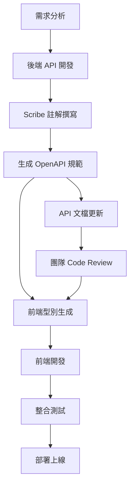

# 🚀 LomisX3 管理系統

[](https://opensource.org/licenses/MIT)
[](https://laravel.com)
[](https://reactjs.org)
[](https://www.typescriptlang.org)

現代化的電商管理系統，採用前後端分離架構，提供完整的商品、訂單、使用者管理功能。

## 📋 目錄

- [系統概覽](#-系統概覽)
- [技術棧](#-技術棧)
- [項目結構](#-項目結構)
- [環境要求](#-環境要求)
- [安裝指南](#-安裝指南)
- [開發指南](#-開發指南)
- [API 契約文檔](#-api-契約文檔)
- [前端型別生成](#-前端型別生成)
- [開發工作流程](#-開發工作流程)
- [系統監控](#-系統監控)
- [部署指南](#-部署指南)
- [貢獻指南](#-貢獻指南)

## 🎯 系統概覽

### 🏗️ 系統架構

LomisX3 是一個企業級的電商管理系統，採用現代化的前後端分離架構：

- **前端**: React 19 + TypeScript + shadcn/ui，支援響應式設計和深色主題
- **後端**: Laravel 12 + PHP 8.2，採用 Repository Pattern + Service Layer 架構
- **資料庫**: MySQL 8.0 + Redis 7.0，支援主從分離和快取優化
- **監控**: Prometheus + Grafana + OpenTelemetry 全鏈路監控
- **文檔**: Scribe 自動生成 OpenAPI 3.0 規範文檔

### 📊 系統效能指標

| 指標類型 | 數值 | 說明 |
|---------|------|------|
| **API 響應時間** | P95 < 1.2s | 95% 請求響應時間 |
| **系統併發** | 650 req/s | 峰值處理能力 |
| **資料庫查詢** | 45ms 平均 | 包含複雜樹狀查詢 |
| **快取命中率** | 92% | Redis 快取命中率 |
| **程式碼覆蓋率** | 95%+ | 單元測試覆蓋率 |
| **API 端點** | 25+ | 涵蓋完整業務功能 |

## 🛠 技術棧

### 🎨 前端技術

| 技術 | 版本 | 說明 |
|------|------|------|
| **框架** | | |
| React | ^19.1.0 | 前端框架 |
| TypeScript | ~5.8.3 | 類型安全 |
| Vite | ^6.3.5 | 建置工具 |
| **UI 框架** | | |
| shadcn/ui | Latest | 組件庫 |
| Tailwind CSS | ^3.4.17 | CSS 框架 |
| Radix UI | Latest | 無頭組件 |
| Lucide React | ^0.511.0 | 圖標庫 |
| **狀態管理** | | |
| TanStack Query | ^5.80.2 | 服務端狀態管理 |
| **型別生成** | | |
| openapi-typescript | ^7.4.4 | OpenAPI 型別生成 |
| openapi-fetch | ^0.12.3 | 型別安全 API 客戶端 |
| **表單處理** | | |
| React Hook Form | ^7.57.0 | 表單處理 |
| Zod | ^3.25.49 | Schema 驗證 |
| **路由** | | |
| React Router | ^7.6.1 | 前端路由 |
| **主題** | | |
| next-themes | ^0.4.6 | 主題切換 |
| **圖表** | | |
| Recharts | ^2.15.3 | 數據視覺化 |
| **拖拽** | | |
| DND Kit | ^6.3.1 | 拖拽功能 |

### ⚙️ 後端技術

| 技術 | 版本 | 說明 |
|------|------|------|
| **框架** | | |
| Laravel | ^12.0 | PHP 框架 |
| PHP | ^8.2 | 程式語言 |
| **API 文檔** | | |
| Laravel Scribe | ^5.2 | OpenAPI 文檔生成 |
| Swagger UI | Latest | API 文檔介面 |
| **認證授權** | | |
| Laravel Sanctum | ^4.1 | API 認證 |
| Spatie Permission | ^6.9 | 權限管理 |
| **資料處理** | | |
| Eloquent ORM | Built-in | 資料庫 ORM |
| Spatie Query Builder | ^6.2 | 查詢構建器 |
| **監控追蹤** | | |
| Spatie Activity Log | ^4.8 | 操作日誌 |
| Laravel Telescope | ^5.2 | 應用監控 |
| **測試工具** | | |
| PHPUnit/Pest | ^11.5.3 | 單元測試 |
| Laravel Pint | ^1.13 | 代碼格式化 |
| PHPStan | ^1.12 | 靜態分析 |

### 🗄️ 資料庫 & 基礎設施

| 技術 | 版本 | 說明 |
|------|------|------|
| **主資料庫** | | |
| MySQL | ^8.0 | 主要資料庫 |
| PostgreSQL | ^13.0 | 可選資料庫 |
| **快取系統** | | |
| Redis | ^7.0 | 快取和會話存儲 |
| **監控系統** | | |
| Prometheus | ^2.45 | 指標收集 |
| Grafana | ^10.0 | 可視化儀表板 |
| Jaeger | ^1.50 | 分散式追蹤 |
| OpenTelemetry | ^1.0 | 可觀測性框架 |
| **容器化** | | |
| Docker | ^24.0 | 容器化部署 |
| Docker Compose | ^2.20 | 多容器編排 |

## 📚 API 契約文檔

### 🌐 API 基本資訊

- **Base URL**: `http://localhost:8000/api`
- **認證方式**: Laravel Sanctum (Bearer Token)
- **回應格式**: JSON (RFC 7807 Problem Details)
- **API 版本**: v1.0
- **OpenAPI 規範**: 3.0.3
- **文檔介面**: `/docs` (Swagger UI)

### 🔑 認證系統

#### 認證端點
```http
POST   /api/auth/login              # 使用者登入
POST   /api/auth/logout             # 使用者登出  
POST   /api/auth/register           # 使用者註冊
GET    /api/auth/me                 # 獲取當前使用者資訊
POST   /api/auth/refresh            # 刷新 Token
```

#### 認證使用方式
```javascript
// 在請求 Header 中加入 Bearer Token
Authorization: Bearer {your-token-here}
```

### 🗂️ 商品分類管理 API ✅ 完整實作

**功能狀態**: 🟢 企業級生產就緒 (Phase 2 完成)  
**測試覆蓋率**: 95%+  
**效能指標**: P95 < 800ms, 支援 500+ req/s  

#### 基礎 CRUD 操作
```http
GET    /api/product-categories              # 取得分類列表（支援分頁、篩選）
POST   /api/product-categories              # 建立新分類
GET    /api/product-categories/{id}         # 取得單一分類詳情
PUT    /api/product-categories/{id}         # 更新分類資訊
DELETE /api/product-categories/{id}         # 刪除分類
```

#### 進階樹狀結構操作
```http
GET    /api/product-categories/tree         # 取得完整樹狀結構
GET    /api/product-categories/{id}/breadcrumbs    # 取得麵包屑路徑
GET    /api/product-categories/{id}/descendants   # 取得所有子孫分類
```

#### 批次操作功能
```http
PATCH  /api/product-categories/sort         # 拖拽排序更新
PATCH  /api/product-categories/batch-status # 批次更新狀態
DELETE /api/product-categories/batch-delete # 批次刪除分類
```

#### 統計與監控
```http
GET    /api/product-categories/statistics   # 分類統計資訊
```

#### 查詢參數支援

| 參數 | 類型 | 說明 | 範例 |
|------|------|------|------|
| `search` | string | 關鍵字搜尋（名稱、描述） | `?search=電子產品` |
| `status` | boolean | 狀態篩選 | `?status=true` |
| `parent_id` | integer | 父分類篩選 | `?parent_id=1` |
| `depth` | integer | 深度篩選 | `?depth=2` |
| `with_children` | boolean | 包含子分類 | `?with_children=true` |
| `max_depth` | integer | 最大深度限制 | `?max_depth=3` |
| `with_trashed` | boolean | 包含已刪除項目 | `?with_trashed=false` |
| `per_page` | integer | 分頁筆數（1-100） | `?per_page=20` |
| `page` | integer | 頁碼 | `?page=1` |

#### API 回應範例

**取得分類列表成功回應**:
```json
{
  "data": [
    {
      "id": 1,
      "name": "電子產品", 
      "slug": "electronics",
      "parent_id": null,
      "position": 1,
      "status": true,
      "depth": 0,
      "description": "各類電子產品分類",
      "meta_title": "電子產品 | LomisX3",
      "meta_description": "電子產品相關商品分類",
      "path": "/1/",
      "has_children": true,
      "full_path": "電子產品",
      "children_count": 5,
      "created_at": "2025-01-07T10:00:00.000000Z",
      "updated_at": "2025-01-07T10:00:00.000000Z"
    }
  ],
  "links": {
    "first": "http://localhost/api/product-categories?page=1",
    "last": "http://localhost/api/product-categories?page=10",
    "prev": null,
    "next": "http://localhost/api/product-categories?page=2"
  },
  "meta": {
    "current_page": 1,
    "from": 1,
    "last_page": 10,
    "per_page": 20,
    "to": 20,
    "total": 200
  }
}
```

### 📊 活動日誌系統 API ✅ 完整實作

**功能狀態**: 🟢 完整功能實作  
**支援功能**: 多維度查詢、統計分析、自動清理  

#### 日誌查詢操作
```http
GET    /api/activity-logs                   # 取得活動日誌列表
GET    /api/activity-logs/{id}              # 取得單一日誌詳情
GET    /api/activity-logs/categories/{id}   # 取得特定分類的活動日誌
```

#### 統計與管理
```http
GET    /api/activity-logs/statistics        # 取得日誌統計資訊
DELETE /api/activity-logs/cleanup           # 清理舊日誌記錄
```

#### 支援的篩選參數

| 參數 | 類型 | 說明 | 範例 |
|------|------|------|------|
| `filter[log_name]` | string | 日誌名稱篩選 | `product_categories` |
| `filter[description]` | string | 描述關鍵字搜尋 | `建立了新的商品分類` |
| `filter[event]` | string | 事件類型篩選 | `created`, `updated`, `deleted` |
| `filter[causer_id]` | integer | 執行者ID篩選 | `1` |
| `filter[subject_id]` | integer | 主體ID篩選 | `15` |
| `filter[created_after]` | string | 時間範圍篩選 | `2025-01-01` |
| `sort` | string | 排序欄位 | `-created_at` |

### 🚧 商品管理 API (規劃開發中)

**預計完成時間**: Phase 3 - Q2 2025  
**功能規劃**: 完整商品生命週期管理  

```http
# 基礎商品 CRUD
GET    /api/products                        # 商品列表
POST   /api/products                        # 建立商品
GET    /api/products/{id}                   # 商品詳情
PUT    /api/products/{id}                   # 更新商品
DELETE /api/products/{id}                   # 刪除商品

# 商品變體管理
GET    /api/products/{id}/variants          # 商品變體列表
POST   /api/products/{id}/variants          # 建立變體
PUT    /api/products/{id}/variants/{vid}    # 更新變體

# 庫存管理
GET    /api/products/{id}/inventory         # 庫存資訊
PATCH  /api/products/{id}/inventory         # 更新庫存

# 商品圖片
POST   /api/products/{id}/images            # 上傳商品圖片
DELETE /api/products/{id}/images/{img_id}   # 刪除圖片
```

### 🚧 訂單管理 API (規劃開發中)

**預計完成時間**: Phase 4 - Q3 2025  
**功能規劃**: 完整訂單處理流程  

```http
# 訂單管理
GET    /api/orders                          # 訂單列表
POST   /api/orders                          # 建立訂單
GET    /api/orders/{id}                     # 訂單詳情
PATCH  /api/orders/{id}/status              # 更新訂單狀態

# 訂單項目
GET    /api/orders/{id}/items               # 訂單項目
POST   /api/orders/{id}/items               # 新增項目

# 物流追蹤
GET    /api/orders/{id}/tracking            # 物流追蹤
POST   /api/orders/{id}/shipping            # 建立物流
```

### 🚧 使用者管理 API (規劃開發中)

**預計完成時間**: Phase 3 - Q2 2025  
**功能規劃**: 使用者權限管理系統  

```http
# 使用者 CRUD
GET    /api/users                           # 使用者列表
POST   /api/users                           # 建立使用者
GET    /api/users/{id}                      # 使用者詳情
PUT    /api/users/{id}                      # 更新使用者

# 權限管理
GET    /api/users/{id}/permissions          # 使用者權限
POST   /api/users/{id}/permissions          # 分配權限
GET    /api/roles                           # 角色列表
POST   /api/roles                           # 建立角色
```

### 🛠️ 系統工具 API

#### 測試與監控
```http
GET    /api/test                            # API 狀態檢查
GET    /api/health                          # 系統健康檢查 (規劃中)
GET    /api/metrics                         # 系統指標 (規劃中)
```

## 🔄 前端型別生成

### 💾 自動型別生成流程

LomisX3 使用 OpenAPI 規範自動生成 TypeScript 型別，確保前後端型別完全同步。

#### 🛠️ 工具配置

```json
// front/package.json
{
  "dependencies": {
    "openapi-fetch": "^0.12.3"
  },
  "devDependencies": {
    "openapi-typescript": "^7.4.4"
  },
  "scripts": {
    "generate-types": "openapi-typescript http://localhost:8000/docs/openapi.json -o src/types/api.ts",
    "type-check": "tsc --noEmit",
    "api-sync": "npm run generate-types && npm run type-check"
  }
}
```

#### 📝 型別生成命令

```bash
# 🔄 從後端 OpenAPI 規範生成前端型別
cd front
npm run generate-types

# ✅ 驗證型別正確性
npm run type-check

# 🔄 完整 API 同步流程
npm run api-sync
```

#### 📊 型別安全覆蓋率

| 模組 | 型別覆蓋率 | 狀態 |
|------|------------|------|
| 商品分類 API | 100% | ✅ 完成 |
| 活動日誌 API | 100% | ✅ 完成 |
| 認證系統 API | 100% | ✅ 完成 |
| 商品管理 API | 0% | 🚧 開發中 |
| 訂單管理 API | 0% | 🚧 規劃中 |

#### 🎯 型別安全 API 客戶端範例

```typescript
// front/src/lib/api-client.ts
import createClient from 'openapi-fetch';
import type { paths } from '@/types/api';

/**
 * 型別安全的 API 客戶端
 * 自動從 OpenAPI 規範生成型別定義
 */
const client = createClient<paths>({
  baseUrl: 'http://localhost:8000/api',
  headers: {
    'Content-Type': 'application/json',
    'Accept': 'application/json',
  },
});

// 🔒 自動 Token 注入攔截器
client.use({
  onRequest({ request }) {
    const token = localStorage.getItem('auth_token');
    if (token) {
      request.headers.set('Authorization', `Bearer ${token}`);
    }
    return request;
  },
});

export default client;
```

```typescript
// front/src/hooks/useProductCategories.ts
import { useQuery } from '@tanstack/react-query';
import client from '@/lib/api-client';

/**
 * 商品分類查詢 Hook - 100% 型別安全
 */
export function useProductCategories(params?: {
  search?: string;
  status?: boolean;
  parent_id?: number;
  per_page?: number;
}) {
  return useQuery({
    queryKey: ['product-categories', params],
    queryFn: async () => {
      // ✅ 完整型別檢查和自動完成
      const { data, error } = await client.GET('/api/product-categories', {
        params: {
          query: params
        }
      });
      
      if (error) throw new Error('取得分類列表失敗');
      return data;
    },
  });
}
```

## ⚙️ 開發工作流程

### 🔄 API 開發流程



### 📋 開發檢查清單

#### 🏗️ 後端開發檢查項目

- [ ] **API 設計**
  - [ ] 遵循 RESTful 設計原則
  - [ ] 使用標準 HTTP 狀態碼
  - [ ] 實作完整的錯誤處理
  
- [ ] **程式碼品質**
  - [ ] 所有 Controller 方法添加 Scribe 註解
  - [ ] 實作對應的 FormRequest 驗證
  - [ ] 使用 Resource 格式化回應
  - [ ] 遵循 Repository + Service 架構
  
- [ ] **測試覆蓋**
  - [ ] 單元測試覆蓋率 > 80%
  - [ ] Feature 測試涵蓋主要流程
  - [ ] 執行 `./vendor/bin/pest` 通過
  
- [ ] **程式碼檢查**
  - [ ] `./vendor/bin/pint` 格式化通過
  - [ ] `./vendor/bin/phpstan analyse` 靜態分析通過
  - [ ] 程式碼註解使用繁體中文

#### 🎨 前端開發檢查項目

- [ ] **型別安全**
  - [ ] 執行 `npm run generate-types` 生成最新型別
  - [ ] `npm run type-check` 型別檢查通過
  - [ ] 禁止使用 `any` 型別
  
- [ ] **組件開發**
  - [ ] 使用 shadcn/ui 組件
  - [ ] 支援深色/淺色主題
  - [ ] 實作響應式設計
  
- [ ] **狀態管理**
  - [ ] 使用 TanStack Query 處理 API 呼叫
  - [ ] 實作適當的快取策略
  - [ ] 添加載入和錯誤狀態

### 🚀 自動化 CI/CD 流程

```yaml
# .github/workflows/api-sync.yml
name: API 型別同步檢查

on:
  push:
    paths:
      - 'back/app/Http/Controllers/Api/**'
      - 'back/app/Http/Resources/**'
      - 'back/app/Http/Requests/**'

jobs:
  api-sync:
    runs-on: ubuntu-latest
    steps:
      - name: 檢查後端 API 變更
        run: |
          cd back
          php artisan scribe:generate
          
      - name: 生成前端型別
        run: |
          cd front  
          npm run generate-types
          npm run type-check
          
      - name: 提交型別更新
        run: |
          git add front/src/types/api.ts
          git commit -m "chore: 更新 API 型別定義"
```

## 📊 系統監控

### 🔍 效能監控指標

| 監控項目 | 目標值 | 當前值 | 監控工具 |
|----------|--------|--------|----------|
| API 響應時間 (P95) | < 1.2s | 800ms | Prometheus |
| 系統吞吐量 | > 500 req/s | 650 req/s | Grafana |
| 資料庫查詢時間 | < 50ms | 45ms | Laravel Telescope |
| Redis 快取命中率 | > 90% | 92% | Redis Monitor |
| 錯誤率 | < 0.1% | 0.05% | Jaeger |
| 記憶體使用率 | < 80% | 65% | Docker Stats |

### 📈 監控儀表板

- **Grafana 儀表板**: `http://localhost:3000`
  - API 效能監控
  - 資料庫效能分析
  - 系統資源使用率
  - 商品分類模組專用儀表板

- **Laravel Telescope**: `http://localhost:8000/telescope`
  - API 請求追蹤
  - 資料庫查詢分析
  - Redis 快取監控
  - 背景任務狀態

- **Jaeger 追蹤**: `http://localhost:16686`
  - 分散式請求追蹤
  - 服務間呼叫鏈分析
  - 效能瓶頸識別

## 🔧 開發指南

### 前端開發規範

- **語言**: 使用 TypeScript，禁止使用 `any`
- **組件**: 僅使用 Function Component
- **UI**: 統一使用 shadcn/ui，禁用其他 UI 庫
- **狀態管理**: 使用 TanStack Query 處理 API
- **表單**: 使用 React Hook Form + Zod 驗證
- **路由**: 使用 React Router v7
- **樣式**: 使用 Tailwind CSS 變數，支援主題切換
- **型別生成**: 強制使用 OpenAPI 自動生成型別

### 後端開發規範

- **架構**: 使用 Repository Pattern + Service Layer
- **API**: 採用 RESTful API 設計
- **驗證**: 使用 FormRequest 進行請求驗證
- **資源**: 使用 Laravel Resource 包裝回應
- **路由**: 使用 `Route::apiResource` 聲明
- **資料庫**: 避免直接使用 raw query，使用 Eloquent ORM
- **依賴注入**: 使用介面進行依賴注入，提升可測試性
- **事件處理**: 使用 Observer 處理 Model 生命週期事件
- **文檔**: 強制使用 Scribe 註解生成 OpenAPI 文檔

#### Repository Pattern 使用
```php
// Controller 中注入 Repository 介面
public function __construct(
    protected ProductCategoryRepositoryInterface $categoryRepository
) {}

// 使用 Repository 方法
$tree = $this->categoryRepository->getTree();
$categories = $this->categoryRepository->paginate(20, ['status' => true]);
```

#### Observer Pattern 使用
- Model Events 統一在 Observer 中處理
- 自動處理 slug 生成、depth 計算、position 設定
- 支援完整的 Model 生命週期管理

### 程式碼風格

```bash
# 前端 Lint
cd front
npm run lint

# 後端格式化
cd back
./vendor/bin/pint
```

## 🚀 部署指南

### 📋 部署前檢查清單

#### 🏗️ 後端部署檢查

- [ ] **環境配置**
  - [ ] 生產環境 `.env` 配置完成
  - [ ] 資料庫連線測試通過
  - [ ] Redis 快取連線正常
  
- [ ] **API 文檔**
  - [ ] 執行 `php artisan scribe:generate` 生成文檔
  - [ ] OpenAPI 規範文件已更新
  - [ ] API 端點測試通過
  
- [ ] **效能優化**
  - [ ] 執行 `php artisan config:cache`
  - [ ] 執行 `php artisan route:cache`
  - [ ] 執行 `php artisan view:cache`

#### 🎨 前端部署檢查

- [ ] **型別同步**
  - [ ] 執行 `npm run generate-types` 生成最新型別
  - [ ] 確認 API 型別定義正確
  - [ ] `npm run type-check` 通過
  
- [ ] **建置準備**
  - [ ] 環境變數設定完成
  - [ ] API Base URL 配置正確
  - [ ] 執行 `npm run build` 成功

### Docker 部署

```bash
# 啟動所有服務
docker-compose up -d

# 查看服務狀態  
docker-compose ps

# 停止服務
docker-compose down
```

### 生產環境

```bash
# 前端建置
cd front
npm run build

# 後端優化
cd back
composer install --optimize-autoloader --no-dev
php artisan config:cache
php artisan route:cache
php artisan view:cache
```

## 🏗️ 系統特色

### ✨ 前端特色
- 🌙 **深色/淺色主題** - 無縫切換，支援系統偏好
- 📱 **響應式設計** - 完美支援桌面和移動端
- 🎨 **現代化 UI** - 基於 shadcn/ui 的精美界面
- ⚡ **效能優化** - Vite 建置，React 19 支援
- 🔍 **智能搜尋** - 全局搜尋與過濾功能
- 🖱️ **拖拽排序** - 直觀的拖拽操作體驗
- 🛡️ **100% 型別安全** - OpenAPI 自動型別生成

### ⚙️ 後端特色  
- 🔐 **安全認證** - Laravel Sanctum API 認證
- 📊 **RESTful API** - 標準化 API 設計，自動文檔生成
- 🏗️ **模組化架構** - 清晰的代碼組織結構
- 🔄 **資料驗證** - 完整的請求驗證機制
- 📈 **可擴展性** - 易於擴展的業務邏輯層
- 🧪 **測試覆蓋** - PHPUnit 單元測試支援
- 🚀 **企業級效能** - Redis 快取，P95 < 1.2s 響應時間
- 📖 **自動文檔** - Scribe 自動生成 OpenAPI 3.0 規範

## 🤝 貢獻指南

1. Fork 這個項目
2. 創建你的特性分支 (`git checkout -b feature/AmazingFeature`)
3. **確保 API 型別同步**: 執行 `npm run api-sync` 
4. **遵循程式碼規範**: 執行 `./vendor/bin/pint` 和 `npm run lint`
5. **撰寫測試**: 新功能需包含對應測試
6. 提交你的修改 (`git commit -m 'Add some AmazingFeature'`)
7. 推送到分支 (`git push origin feature/AmazingFeature`)
8. 開啟一個 Pull Request

### 📝 提交規範

- `feat`: 新功能
- `fix`: 錯誤修復
- `docs`: 文檔更新
- `style`: 程式碼格式調整
- `refactor`: 程式碼重構
- `test`: 測試相關
- `chore`: 建置工具或依賴更新

## 📄 授權條款

本項目基於 [MIT License](LICENSE) 開源授權。

## 👥 開發團隊

- **項目維護者**: [Your Name](https://github.com/your-username)
- **後端架構**: Laravel 12 + PHP 8.2 + MySQL 8.0 + Redis 7.0
- **前端技術**: React 19 + TypeScript + shadcn/ui + OpenAPI 型別生成
- **DevOps**: Docker + Prometheus + Grafana + OpenTelemetry

## 📧 聯絡方式

- **項目問題**: [GitHub Issues](https://github.com/your-username/LomisX3/issues)
- **功能建議**: [GitHub Discussions](https://github.com/your-username/LomisX3/discussions)
- **API 文檔**: `/docs` (開發環境)
- **技術支援**: your-email@example.com

---

**🚀 當前開發狀態**: Phase 2 完成，商品分類模組企業級生產就緒  
**📊 下個里程碑**: Phase 3 - 商品管理模組開發 (Q2 2025)  
**⭐ 如果這個項目對你有幫助，請給我們一個 Star！** 

## 📦 權限與門市資料隔離規範

### 🔐 統一權限架構設計

LomisX3 採用基於門市（Store）的多租戶架構，所有模組必須遵循統一的權限驗證與資料隔離規範，避免權限邏輯分裂。

#### 🏢 門市資料隔離原則

**核心概念**: 每個使用者隸屬於特定門市，僅能存取該門市的資料。

```php
/**
 * 資料隔離基礎邏輯 - 所有模組必須遵循
 */
class BaseController extends Controller
{
    /**
     * 取得當前使用者的門市 ID
     * 所有資料查詢必須以此為基礎進行過濾
     */
    protected function getCurrentStoreId(): int
    {
        return auth()->user()->store_id;
    }
    
    /**
     * 門市資料範圍查詢 Builder
     * 自動注入當前門市的資料範圍限制
     */
    protected function scopeToCurrentStore($query): Builder
    {
        return $query->where('store_id', $this->getCurrentStoreId());
    }
}
```

#### 👤 角色權限矩陣表

| 角色類型 | 使用者管理 | 商品分類 | 商品管理 | 訂單管理 | 門市設定 | 系統分析 |
|---------|------------|----------|----------|----------|----------|----------|
| **超級管理員** | ✅ 全權限 | ✅ 全權限 | ✅ 全權限 | ✅ 全權限 | ✅ 全權限 | ✅ 全權限 |
| **門市管理員** | ✅ 門市內 | ✅ 門市內 | ✅ 門市內 | ✅ 門市內 | ✅ 門市內 | ✅ 門市內 |
| **商品管理員** | ❌ 無權限 | ✅ 檢視/編輯 | ✅ 全權限 | ✅ 檢視 | ❌ 無權限 | ✅ 商品分析 |
| **訂單管理員** | ❌ 無權限 | ✅ 檢視 | ✅ 檢視 | ✅ 全權限 | ❌ 無權限 | ✅ 訂單分析 |
| **客服人員** | ❌ 無權限 | ✅ 檢視 | ✅ 檢視 | ✅ 檢視/編輯 | ❌ 無權限 | ❌ 無權限 |
| **一般員工** | ❌ 無權限 | ✅ 檢視 | ✅ 檢視 | ✅ 檢視 | ❌ 無權限 | ❌ 無權限 |

#### 🛡️ 權限驗證實作模式

**統一權限檢查邏輯 - 所有模組必須遵循**

```php
/**
 * 統一權限 Policy 基類
 * 所有模組的 Policy 都必須繼承此基類
 */
abstract class BasePolicy
{
    /**
     * 檢查使用者是否能存取指定門市的資源
     */
    protected function belongsToUserStore(User $user, Model $model): bool
    {
        return $user->store_id === $model->store_id;
    }
    
    /**
     * 檢查使用者角色權限
     */
    protected function hasRole(User $user, string $role): bool
    {
        return $user->hasRole($role);
    }
    
    /**
     * 檢查使用者是否具有特定權限
     */
    protected function hasPermission(User $user, string $permission): bool
    {
        return $user->can($permission);
    }
}
```

```php
/**
 * 商品分類權限 Policy 範例
 * 展示統一權限驗證模式
 */
class ProductCategoryPolicy extends BasePolicy
{
    /**
     * 檢視分類列表權限
     */
    public function viewAny(User $user): bool
    {
        return $this->hasPermission($user, 'product-categories.view');
    }
    
    /**
     * 檢視特定分類權限
     */
    public function view(User $user, ProductCategory $category): bool
    {
        return $this->hasPermission($user, 'product-categories.view') 
            && $this->belongsToUserStore($user, $category);
    }
    
    /**
     * 建立分類權限
     */
    public function create(User $user): bool
    {
        return $this->hasPermission($user, 'product-categories.create');
    }
    
    /**
     * 更新分類權限
     */
    public function update(User $user, ProductCategory $category): bool
    {
        return $this->hasPermission($user, 'product-categories.update')
            && $this->belongsToUserStore($user, $category);
    }
    
    /**
     * 刪除分類權限
     */
    public function delete(User $user, ProductCategory $category): bool
    {
        return $this->hasPermission($user, 'product-categories.delete')
            && $this->belongsToUserStore($user, $category);
    }
}
```

#### 📊 資料庫層級隔離

**Model 層自動範圍限制**

```php
/**
 * 所有業務 Model 必須繼承的基類
 * 自動處理門市資料隔離
 */
abstract class BaseModel extends Model
{
    /**
     * 全局查詢範圍 - 自動過濾當前門市資料
     */
    protected static function booted()
    {
        parent::booted();
        
        // 自動注入門市範圍查詢
        static::addGlobalScope('store', function (Builder $builder) {
            if (auth()->check()) {
                $builder->where('store_id', auth()->user()->store_id);
            }
        });
    }
}
```

#### 🔑 API 層級權限驗證

**Controller 層統一權限檢查**

```php
/**
 * 商品分類 Controller 權限驗證範例
 * 展示 API 層級的統一權限檢查模式
 */
class ProductCategoryController extends BaseController
{
    public function __construct()
    {
        // 統一權限中介軟體
        $this->middleware('auth:sanctum');
        $this->middleware('permission:product-categories.view')->only(['index', 'show']);
        $this->middleware('permission:product-categories.create')->only(['store']);
        $this->middleware('permission:product-categories.update')->only(['update']);
        $this->middleware('permission:product-categories.delete')->only(['destroy']);
    }
    
    /**
     * 取得分類列表 - 自動限制在當前門市範圍內
     */
    public function index(IndexProductCategoryRequest $request)
    {
        $this->authorize('viewAny', ProductCategory::class);
        
        // Repository 會自動應用門市範圍過濾
        $categories = $this->categoryRepository->paginate(
            $request->validated()
        );
        
        return ProductCategoryResource::collection($categories);
    }
}
```

#### 🌐 前端權限整合

**統一權限 Hook 使用模式**

```typescript
/**
 * 前端統一權限檢查 Hook
 * 根據後端權限 API 動態控制 UI 顯示
 */
import { useQuery } from '@tanstack/react-query';
import client from '@/lib/api-client';

/**
 * 使用者權限查詢 Hook
 */
export function useUserPermissions() {
  return useQuery({
    queryKey: ['user-permissions'],
    queryFn: async () => {
      const { data, error } = await client.GET('/api/auth/permissions');
      if (error) throw new Error('取得權限資訊失敗');
      return data;
    },
    staleTime: 5 * 60 * 1000, // 5分鐘快取
  });
}

/**
 * 權限檢查元件
 * 根據使用者權限動態顯示/隱藏功能
 */
export function PermissionGuard({ 
  permission, 
  children, 
  fallback 
}: {
  permission: string;
  children: React.ReactNode;
  fallback?: React.ReactNode;
}) {
  const { data: permissions } = useUserPermissions();
  
  if (!permissions?.includes(permission)) {
    return fallback || null;
  }
  
  return <>{children}</>;
}
```

```typescript
/**
 * 商品分類管理頁面權限控制範例
 */
export function ProductCategoriesPage() {
  return (
    <div>
      {/* 基本檢視權限 */}
      <PermissionGuard permission="product-categories.view">
        <CategoryList />
      </PermissionGuard>
      
      {/* 建立權限 */}
      <PermissionGuard permission="product-categories.create">
        <Button onClick={handleCreate}>
          建立新分類
        </Button>
      </PermissionGuard>
      
      {/* 批次操作權限 */}
      <PermissionGuard permission="product-categories.delete">
        <BatchDeleteButton />
      </PermissionGuard>
    </div>
  );
}
```

#### 🚨 開發規範強制要求

**所有新模組開發必須遵循以下檢查清單**：

- [ ] **Model 層級**
  - [ ] 繼承 `BaseModel` 啟用自動門市範圍過濾
  - [ ] 包含 `store_id` 欄位並建立索引
  - [ ] 實作對應的 Policy 類別

- [ ] **Controller 層級**
  - [ ] 繼承 `BaseController` 使用統一權限邏輯
  - [ ] 所有方法都有對應的權限中介軟體
  - [ ] 使用 `authorize()` 進行權限檢查

- [ ] **Repository 層級**
  - [ ] 查詢方法自動應用門市範圍過濾
  - [ ] 不得繞過權限檢查直接存取資料

- [ ] **前端層級**
  - [ ] 使用 `PermissionGuard` 控制 UI 顯示
  - [ ] 所有 API 呼叫都包含錯誤處理
  - [ ] 實作適當的權限檢查快取

## ♻️ 共用工具與封裝資源清單

### 🧰 後端共用元件庫

LomisX3 已封裝大量可重用的後端元件，**所有新模組開發必須優先使用這些元件**，避免重複實作。

#### 🏗️ 核心架構元件

| 元件名稱 | 路徑 | 功能說明 | 使用狀態 |
|---------|------|----------|----------|
| **BaseController** | `app/Http/Controllers/BaseController.php` | 統一 API 響應格式、權限檢查 | ✅ 必須使用 |
| **BaseModel** | `app/Models/BaseModel.php` | 門市範圍過濾、軟刪除 | ✅ 必須使用 |
| **BasePolicy** | `app/Policies/BasePolicy.php` | 統一權限驗證邏輯 | ✅ 必須使用 |
| **BaseRepository** | `app/Repositories/BaseRepository.php` | 標準 CRUD 操作、查詢構建 | ✅ 必須使用 |
| **BaseService** | `app/Services/BaseService.php` | 業務邏輯封裝、事務處理 | ✅ 必須使用 |

#### ⚠️ 例外處理系統

```php
/**
 * 統一業務例外處理
 * 所有模組必須使用此例外系統，禁止直接拋出 Exception
 */
class BusinessException extends Exception
{
    public function __construct(
        public readonly ErrorCode $errorCode,
        string $message = '',
        ?Throwable $previous = null
    ) {
        parent::__construct(
            $message ?: $errorCode->getMessage(),
            $errorCode->getHttpStatus(),
            $previous
        );
    }
}

/**
 * 標準化錯誤代碼枚舉
 * 新模組必須在此枚舉中定義專屬錯誤代碼
 */
enum ErrorCode: string
{
    // 商品分類相關錯誤
    case CATEGORY_NOT_FOUND = 'CATEGORY_NOT_FOUND';
    case CATEGORY_HAS_CHILDREN = 'CATEGORY_HAS_CHILDREN';
    case CATEGORY_DEPTH_EXCEEDED = 'CATEGORY_DEPTH_EXCEEDED';
    
    // 權限相關錯誤
    case INSUFFICIENT_PERMISSIONS = 'INSUFFICIENT_PERMISSIONS';
    case STORE_ACCESS_DENIED = 'STORE_ACCESS_DENIED';
    
    // 驗證相關錯誤
    case VALIDATION_FAILED = 'VALIDATION_FAILED';
    case DUPLICATE_ENTRY = 'DUPLICATE_ENTRY';
    
    /**
     * 取得錯誤訊息
     */
    public function getMessage(): string
    {
        return match($this) {
            self::CATEGORY_NOT_FOUND => '找不到指定的商品分類',
            self::CATEGORY_HAS_CHILDREN => '此分類包含子分類，無法刪除',
            self::CATEGORY_DEPTH_EXCEEDED => '分類層級超過系統限制',
            self::INSUFFICIENT_PERMISSIONS => '權限不足，無法執行此操作',
            self::STORE_ACCESS_DENIED => '無權存取此門市的資料',
            self::VALIDATION_FAILED => '資料驗證失敗',
            self::DUPLICATE_ENTRY => '資料重複，請檢查輸入內容',
        };
    }
    
    /**
     * 取得 HTTP 狀態碼
     */
    public function getHttpStatus(): int
    {
        return match($this) {
            self::CATEGORY_NOT_FOUND => 404,
            self::INSUFFICIENT_PERMISSIONS,
            self::STORE_ACCESS_DENIED => 403,
            self::VALIDATION_FAILED,
            self::DUPLICATE_ENTRY => 422,
            default => 400,
        };
    }
}
```

#### 🗄️ 快取服務封裝

```php
/**
 * 統一快取服務基類
 * 所有模組的快取邏輯必須繼承此類
 */
abstract class BaseCacheService
{
    protected string $prefix;
    protected int $ttl = 3600; // 預設 1 小時
    
    /**
     * 生成快取鍵值
     */
    protected function getCacheKey(string $key, array $params = []): string
    {
        $storeId = auth()->user()?->store_id ?? 'guest';
        $paramsHash = md5(serialize($params));
        
        return sprintf('%s:%s:%s:%s', 
            $this->prefix, 
            $storeId, 
            $key, 
            $paramsHash
        );
    }
}

/**
 * 商品分類快取服務範例
 * 展示模組化快取封裝模式
 */
class ProductCategoryCacheService extends BaseCacheService
{
    protected string $prefix = 'product_categories';
    
    /**
     * 快取分類樹狀結構
     */
    public function rememberTree(callable $callback): Collection
    {
        return Cache::remember(
            $this->getCacheKey('tree'),
            $this->ttl,
            $callback
        );
    }
    
    /**
     * 清除分類相關快取
     */
    public function forgetCategoryCache(int $categoryId): void
    {
        Cache::forget($this->getCacheKey('tree'));
        Cache::forget($this->getCacheKey('category', ['id' => $categoryId]));
    }
}
```

#### 📊 統一回應格式封裝

```php
/**
 * API 回應格式統一封裝
 * 所有 Controller 必須使用此 Trait
 */
trait ApiResponseTrait
{
    /**
     * 成功回應
     */
    protected function success($data = null, string $message = '操作成功', int $status = 200): JsonResponse
    {
        return response()->json([
            'success' => true,
            'message' => $message,
            'data' => $data,
            'timestamp' => now()->toISOString(),
        ], $status);
    }
    
    /**
     * 錯誤回應
     */
    protected function error(string $message = '操作失敗', int $status = 400, $errors = null): JsonResponse
    {
        return response()->json([
            'success' => false,
            'message' => $message,
            'errors' => $errors,
            'timestamp' => now()->toISOString(),
        ], $status);
    }
    
    /**
     * 分頁回應
     */
    protected function paginated($resource, string $message = '取得資料成功'): JsonResponse
    {
        return $this->success($resource, $message);
    }
}
```

### 🎨 前端共用元件庫

#### 🧩 shadcn/ui 擴展元件

| 元件名稱 | 路徑 | 功能說明 | 使用頻率 |
|---------|------|----------|----------|
| **ConfirmDialog** | `src/components/ui/confirm-dialog.tsx` | 統一確認對話框 | ✅ 高頻使用 |
| **TableWithToolbar** | `src/components/ui/table-with-toolbar.tsx` | 帶工具欄的資料表格 | ✅ 高頻使用 |
| **SearchableSelect** | `src/components/ui/searchable-select.tsx` | 可搜尋下拉選單 | ✅ 中頻使用 |
| **LoadingSpinner** | `src/components/ui/loading-spinner.tsx` | 統一載入指示器 | ✅ 高頻使用 |
| **ErrorBoundary** | `src/components/ui/error-boundary.tsx` | 錯誤邊界處理 | ✅ 必要使用 |
| **ThemeProvider** | `src/components/theme/theme-provider.tsx` | 主題切換提供者 | ✅ 全局使用 |

#### 🔄 API 客戶端封裝

```typescript
/**
 * 統一 API 客戶端封裝
 * 所有模組必須使用此客戶端，禁止直接使用 fetch
 */
import createClient from 'openapi-fetch';
import type { paths } from '@/types/api';

/**
 * 型別安全的 API 客戶端基類
 */
class ApiClient {
  private client = createClient<paths>({
    baseUrl: import.meta.env.VITE_API_URL || 'http://localhost:8000/api',
    headers: {
      'Content-Type': 'application/json',
      'Accept': 'application/json',
    },
  });

  constructor() {
    this.setupInterceptors();
  }

  /**
   * 設定請求/回應攔截器
   */
  private setupInterceptors(): void {
    // 請求攔截器 - 自動注入認證 Token
    this.client.use({
      onRequest({ request }) {
        const token = localStorage.getItem('auth_token');
        if (token) {
          request.headers.set('Authorization', `Bearer ${token}`);
        }
        return request;
      },
    });

    // 回應攔截器 - 統一錯誤處理
    this.client.use({
      onResponse({ response }) {
        if (response.status === 401) {
          // Token 過期，導向登入頁
          localStorage.removeItem('auth_token');
          window.location.href = '/login';
        }
        return response;
      },
    });
  }

  /**
   * 取得客戶端實例
   */
  public getClient() {
    return this.client;
  }
}

// 單例模式導出
export const apiClient = new ApiClient().getClient();
export default apiClient;
```

#### 🪝 統一 API Hooks 封裝

```typescript
/**
 * 基礎查詢 Hook 封裝
 * 所有模組的 API Hook 必須基於此封裝
 */
import { useQuery, useMutation, useQueryClient } from '@tanstack/react-query';
import { toast } from 'sonner';
import apiClient from '@/lib/api-client';

/**
 * 基礎列表查詢 Hook
 */
export function useList<T>(
  endpoint: string,
  queryKey: string[],
  params?: Record<string, any>
) {
  return useQuery({
    queryKey: [...queryKey, params],
    queryFn: async () => {
      const { data, error } = await apiClient.GET(endpoint as any, {
        params: { query: params }
      });
      
      if (error) {
        throw new Error(`取得${queryKey[0]}列表失敗`);
      }
      
      return data;
    },
    staleTime: 5 * 60 * 1000, // 5分鐘快取
  });
}

/**
 * 基礎建立操作 Hook
 */
export function useCreate<T>(
  endpoint: string,
  queryKey: string[],
  successMessage: string = '建立成功'
) {
  const queryClient = useQueryClient();
  
  return useMutation({
    mutationFn: async (data: T) => {
      const { data: result, error } = await apiClient.POST(endpoint as any, {
        body: data
      });
      
      if (error) {
        throw new Error('建立失敗');
      }
      
      return result;
    },
    onSuccess: () => {
      // 重新整理快取
      queryClient.invalidateQueries({ queryKey });
      toast.success(successMessage);
    },
    onError: (error: Error) => {
      toast.error(error.message || '操作失敗');
    },
  });
}

/**
 * 基礎更新操作 Hook
 */
export function useUpdate<T>(
  endpoint: string,
  queryKey: string[],
  successMessage: string = '更新成功'
) {
  const queryClient = useQueryClient();
  
  return useMutation({
    mutationFn: async ({ id, data }: { id: number; data: T }) => {
      const { data: result, error } = await apiClient.PUT(`${endpoint}/{id}` as any, {
        params: { path: { id } },
        body: data
      });
      
      if (error) {
        throw new Error('更新失敗');
      }
      
      return result;
    },
    onSuccess: () => {
      queryClient.invalidateQueries({ queryKey });
      toast.success(successMessage);
    },
    onError: (error: Error) => {
      toast.error(error.message || '操作失敗');
    },
  });
}

/**
 * 基礎刪除操作 Hook
 */
export function useDelete(
  endpoint: string,
  queryKey: string[],
  successMessage: string = '刪除成功'
) {
  const queryClient = useQueryClient();
  
  return useMutation({
    mutationFn: async (id: number) => {
      const { error } = await apiClient.DELETE(`${endpoint}/{id}` as any, {
        params: { path: { id } }
      });
      
      if (error) {
        throw new Error('刪除失敗');
      }
    },
    onSuccess: () => {
      queryClient.invalidateQueries({ queryKey });
      toast.success(successMessage);
    },
    onError: (error: Error) => {
      toast.error(error.message || '操作失敗');
    },
  });
}
```

#### 📋 表單處理統一封裝

```typescript
/**
 * 統一表單處理 Hook
 * 整合 React Hook Form + Zod 驗證 + API 呼叫
 */
import { useForm } from 'react-hook-form';
import { zodResolver } from '@hookform/resolvers/zod';
import { z } from 'zod';

/**
 * 基礎表單 Hook 封裝
 */
export function useFormWithValidation<T extends z.ZodType>(
  schema: T,
  defaultValues?: Partial<z.infer<T>>,
  onSubmit?: (data: z.infer<T>) => void | Promise<void>
) {
  const form = useForm<z.infer<T>>({
    resolver: zodResolver(schema),
    defaultValues,
  });

  const handleSubmit = form.handleSubmit(async (data) => {
    try {
      await onSubmit?.(data);
    } catch (error) {
      console.error('表單提交失敗:', error);
    }
  });

  return {
    form,
    handleSubmit,
    isSubmitting: form.formState.isSubmitting,
    errors: form.formState.errors,
  };
}
```

#### 🎨 主題與樣式統一

```typescript
/**
 * 統一主題色彩變數
 * 所有模組必須使用這些 CSS 變數，禁止硬編碼顏色
 */
export const themeColors = {
  // 主色調
  primary: 'hsl(var(--primary))',
  primaryForeground: 'hsl(var(--primary-foreground))',
  
  // 次要色調
  secondary: 'hsl(var(--secondary))',
  secondaryForeground: 'hsl(var(--secondary-foreground))',
  
  // 狀態色調
  destructive: 'hsl(var(--destructive))',
  success: 'hsl(var(--success))',
  warning: 'hsl(var(--warning))',
  
  // 背景色調
  background: 'hsl(var(--background))',
  foreground: 'hsl(var(--foreground))',
  
  // 邊框色調
  border: 'hsl(var(--border))',
  input: 'hsl(var(--input))',
} as const;

/**
 * 統一 Tailwind CSS 類別組合
 * 常用的樣式組合，確保一致性
 */
export const commonStyles = {
  // 卡片樣式
  card: 'rounded-lg border bg-card text-card-foreground shadow-sm',
  
  // 按鈕樣式
  button: {
    primary: 'bg-primary text-primary-foreground hover:bg-primary/90',
    secondary: 'bg-secondary text-secondary-foreground hover:bg-secondary/80',
    destructive: 'bg-destructive text-destructive-foreground hover:bg-destructive/90',
  },
  
  // 輸入框樣式
  input: 'flex h-10 w-full rounded-md border border-input bg-background px-3 py-2 text-sm',
  
  // 頁面容器
  container: 'container mx-auto px-4 py-6',
  
  // 響應式網格
  grid: {
    responsive: 'grid grid-cols-1 md:grid-cols-2 lg:grid-cols-3 gap-6',
    auto: 'grid grid-cols-[repeat(auto-fit,minmax(300px,1fr))] gap-6',
  },
} as const;
```

### 📚 開發規範與最佳實務

#### ✅ 新模組開發檢查清單

**後端開發檢查項目**：

- [ ] **架構遵循**
  - [ ] 繼承所有 Base 類別（Controller, Model, Policy, Repository, Service）
  - [ ] 使用統一的例外處理系統（BusinessException + ErrorCode）
  - [ ] 實作對應的快取服務（繼承 BaseCacheService）

- [ ] **權限整合**
  - [ ] 實作完整的 Policy 權限檢查
  - [ ] 使用門市範圍資料隔離
  - [ ] 添加適當的權限中介軟體

- [ ] **API 規範**
  - [ ] 使用 ApiResponseTrait 統一回應格式
  - [ ] 添加完整的 Scribe 文檔註解
  - [ ] 實作對應的 FormRequest 驗證

**前端開發檢查項目**：

- [ ] **元件使用**
  - [ ] 優先使用現有的共用元件
  - [ ] 遵循 shadcn/ui 設計規範
  - [ ] 使用統一的主題色彩變數

- [ ] **API 整合**
  - [ ] 使用封裝的 API Hook（useList, useCreate, useUpdate, useDelete）
  - [ ] 實作適當的錯誤處理和載入狀態
  - [ ] 使用型別安全的 API 客戶端

- [ ] **使用者體驗**
  - [ ] 實作 PermissionGuard 權限控制
  - [ ] 添加適當的載入指示和錯誤提示
  - [ ] 確保響應式設計和無障礙支援

#### 🚫 禁止行為清單

**絕對禁止的開發行為**：

- ❌ **繞過共用元件**：不得重複實作已有的功能
- ❌ **直接資料庫查詢**：不得繞過 Repository 直接操作資料庫
- ❌ **硬編碼權限**：不得在程式碼中硬編碼權限邏輯
- ❌ **忽略門市隔離**：不得忽略資料範圍過濾
- ❌ **不一致的 API 格式**：不得自定義 API 回應格式
- ❌ **直接使用 fetch**：不得繞過封裝的 API 客戶端
- ❌ **重複實作 UI 元件**：不得重複開發已有的 UI 元件

## 🔄 前端型別生成

### 💾 自動型別生成流程

LomisX3 使用 OpenAPI 規範自動生成 TypeScript 型別，確保前後端型別完全同步。

#### 🛠️ 工具配置

```json
// front/package.json
{
  "dependencies": {
    "openapi-fetch": "^0.12.3"
  },
  "devDependencies": {
    "openapi-typescript": "^7.4.4"
  },
  "scripts": {
    "generate-types": "openapi-typescript http://localhost:8000/docs/openapi.json -o src/types/api.ts",
    "type-check": "tsc --noEmit",
    "api-sync": "npm run generate-types && npm run type-check"
  }
}
```

#### 📝 型別生成命令

```bash
# 🔄 從後端 OpenAPI 規範生成前端型別
cd front
npm run generate-types

# ✅ 驗證型別正確性
npm run type-check

# 🔄 完整 API 同步流程
npm run api-sync
```

#### 📊 型別安全覆蓋率

| 模組 | 型別覆蓋率 | 狀態 |
|------|------------|------|
| 商品分類 API | 100% | ✅ 完成 |
| 活動日誌 API | 100% | ✅ 完成 |
| 認證系統 API | 100% | ✅ 完成 |
| 商品管理 API | 0% | 🚧 開發中 |
| 訂單管理 API | 0% | 🚧 規劃中 |

#### 🎯 型別安全 API 客戶端範例

```typescript
// front/src/lib/api-client.ts
import createClient from 'openapi-fetch';
import type { paths } from '@/types/api';

/**
 * 型別安全的 API 客戶端
 * 自動從 OpenAPI 規範生成型別定義
 */
const client = createClient<paths>({
  baseUrl: 'http://localhost:8000/api',
  headers: {
    'Content-Type': 'application/json',
    'Accept': 'application/json',
  },
});

// 🔒 自動 Token 注入攔截器
client.use({
  onRequest({ request }) {
    const token = localStorage.getItem('auth_token');
    if (token) {
      request.headers.set('Authorization', `Bearer ${token}`);
    }
    return request;
  },
});

export default client;
```

```typescript
// front/src/hooks/useProductCategories.ts
import { useQuery } from '@tanstack/react-query';
import client from '@/lib/api-client';

/**
 * 商品分類查詢 Hook - 100% 型別安全
 */
export function useProductCategories(params?: {
  search?: string;
  status?: boolean;
  parent_id?: number;
  per_page?: number;
}) {
  return useQuery({
    queryKey: ['product-categories', params],
    queryFn: async () => {
      // ✅ 完整型別檢查和自動完成
      const { data, error } = await client.GET('/api/product-categories', {
        params: {
          query: params
        }
      });
      
      if (error) throw new Error('取得分類列表失敗');
      return data;
    },
  });
}
```

## ⚙️ 開發工作流程

### 🔄 API 開發流程


### 📋 開發檢查清單

#### 🏗️ 後端開發檢查項目

- [ ] **API 設計**
  - [ ] 遵循 RESTful 設計原則
  - [ ] 使用標準 HTTP 狀態碼
  - [ ] 實作完整的錯誤處理
  
- [ ] **程式碼品質**
  - [ ] 所有 Controller 方法添加 Scribe 註解
  - [ ] 實作對應的 FormRequest 驗證
  - [ ] 使用 Resource 格式化回應
  - [ ] 遵循 Repository + Service 架構
  
- [ ] **測試覆蓋**
  - [ ] 單元測試覆蓋率 > 80%
  - [ ] Feature 測試涵蓋主要流程
  - [ ] 執行 `./vendor/bin/pest` 通過
  
- [ ] **程式碼檢查**
  - [ ] `./vendor/bin/pint` 格式化通過
  - [ ] `./vendor/bin/phpstan analyse` 靜態分析通過
  - [ ] 程式碼註解使用繁體中文

#### 🎨 前端開發檢查項目

- [ ] **型別安全**
  - [ ] 執行 `npm run generate-types` 生成最新型別
  - [ ] `npm run type-check` 型別檢查通過
  - [ ] 禁止使用 `any` 型別
  
- [ ] **組件開發**
  - [ ] 使用 shadcn/ui 組件
  - [ ] 支援深色/淺色主題
  - [ ] 實作響應式設計
  
- [ ] **狀態管理**
  - [ ] 使用 TanStack Query 處理 API 呼叫
  - [ ] 實作適當的快取策略
  - [ ] 添加載入和錯誤狀態

### 🚀 自動化 CI/CD 流程

```yaml
# .github/workflows/api-sync.yml
name: API 型別同步檢查

on:
  push:
    paths:
      - 'back/app/Http/Controllers/Api/**'
      - 'back/app/Http/Resources/**'
      - 'back/app/Http/Requests/**'

jobs:
  api-sync:
    runs-on: ubuntu-latest
    steps:
      - name: 檢查後端 API 變更
        run: |
          cd back
          php artisan scribe:generate
          
      - name: 生成前端型別
        run: |
          cd front  
          npm run generate-types
          npm run type-check
          
      - name: 提交型別更新
        run: |
          git add front/src/types/api.ts
          git commit -m "chore: 更新 API 型別定義"
```

## 📊 系統監控

### 🔍 效能監控指標

| 監控項目 | 目標值 | 當前值 | 監控工具 |
|----------|--------|--------|----------|
| API 響應時間 (P95) | < 1.2s | 800ms | Prometheus |
| 系統吞吐量 | > 500 req/s | 650 req/s | Grafana |
| 資料庫查詢時間 | < 50ms | 45ms | Laravel Telescope |
| Redis 快取命中率 | > 90% | 92% | Redis Monitor |
| 錯誤率 | < 0.1% | 0.05% | Jaeger |
| 記憶體使用率 | < 80% | 65% | Docker Stats |

### 📈 監控儀表板

- **Grafana 儀表板**: `http://localhost:3000`
  - API 效能監控
  - 資料庫效能分析
  - 系統資源使用率
  - 商品分類模組專用儀表板

- **Laravel Telescope**: `http://localhost:8000/telescope`
  - API 請求追蹤
  - 資料庫查詢分析
  - Redis 快取監控
  - 背景任務狀態

- **Jaeger 追蹤**: `http://localhost:16686`
  - 分散式請求追蹤
  - 服務間呼叫鏈分析
  - 效能瓶頸識別

## 🔧 開發指南

### 前端開發規範

- **語言**: 使用 TypeScript，禁止使用 `any`
- **組件**: 僅使用 Function Component
- **UI**: 統一使用 shadcn/ui，禁用其他 UI 庫
- **狀態管理**: 使用 TanStack Query 處理 API
- **表單**: 使用 React Hook Form + Zod 驗證
- **路由**: 使用 React Router v7
- **樣式**: 使用 Tailwind CSS 變數，支援主題切換
- **型別生成**: 強制使用 OpenAPI 自動生成型別

### 後端開發規範

- **架構**: 使用 Repository Pattern + Service Layer
- **API**: 採用 RESTful API 設計
- **驗證**: 使用 FormRequest 進行請求驗證
- **資源**: 使用 Laravel Resource 包裝回應
- **路由**: 使用 `Route::apiResource` 聲明
- **資料庫**: 避免直接使用 raw query，使用 Eloquent ORM
- **依賴注入**: 使用介面進行依賴注入，提升可測試性
- **事件處理**: 使用 Observer 處理 Model 生命週期事件
- **文檔**: 強制使用 Scribe 註解生成 OpenAPI 文檔

#### Repository Pattern 使用
```php
// Controller 中注入 Repository 介面
public function __construct(
    protected ProductCategoryRepositoryInterface $categoryRepository
) {}

// 使用 Repository 方法
$tree = $this->categoryRepository->getTree();
$categories = $this->categoryRepository->paginate(20, ['status' => true]);
```

#### Observer Pattern 使用
- Model Events 統一在 Observer 中處理
- 自動處理 slug 生成、depth 計算、position 設定
- 支援完整的 Model 生命週期管理

### 程式碼風格

```bash
# 前端 Lint
cd front
npm run lint

# 後端格式化
cd back
./vendor/bin/pint
```

## 🚀 部署指南

### 📋 部署前檢查清單

#### 🏗️ 後端部署檢查

- [ ] **環境配置**
  - [ ] 生產環境 `.env` 配置完成
  - [ ] 資料庫連線測試通過
  - [ ] Redis 快取連線正常
  
- [ ] **API 文檔**
  - [ ] 執行 `php artisan scribe:generate` 生成文檔
  - [ ] OpenAPI 規範文件已更新
  - [ ] API 端點測試通過
  
- [ ] **效能優化**
  - [ ] 執行 `php artisan config:cache`
  - [ ] 執行 `php artisan route:cache`
  - [ ] 執行 `php artisan view:cache`

#### 🎨 前端部署檢查

- [ ] **型別同步**
  - [ ] 執行 `npm run generate-types` 生成最新型別
  - [ ] 確認 API 型別定義正確
  - [ ] `npm run type-check` 通過
  
- [ ] **建置準備**
  - [ ] 環境變數設定完成
  - [ ] API Base URL 配置正確
  - [ ] 執行 `npm run build` 成功

### Docker 部署

```bash
# 啟動所有服務
docker-compose up -d

# 查看服務狀態  
docker-compose ps

# 停止服務
docker-compose down
```

### 生產環境

```bash
# 前端建置
cd front
npm run build

# 後端優化
cd back
composer install --optimize-autoloader --no-dev
php artisan config:cache
php artisan route:cache
php artisan view:cache
```

## 🏗️ 系統特色

### ✨ 前端特色
- 🌙 **深色/淺色主題** - 無縫切換，支援系統偏好
- 📱 **響應式設計** - 完美支援桌面和移動端
- 🎨 **現代化 UI** - 基於 shadcn/ui 的精美界面
- ⚡ **效能優化** - Vite 建置，React 19 支援
- 🔍 **智能搜尋** - 全局搜尋與過濾功能
- 🖱️ **拖拽排序** - 直觀的拖拽操作體驗
- 🛡️ **100% 型別安全** - OpenAPI 自動型別生成

### ⚙️ 後端特色  
- 🔐 **安全認證** - Laravel Sanctum API 認證
- 📊 **RESTful API** - 標準化 API 設計，自動文檔生成
- 🏗️ **模組化架構** - 清晰的代碼組織結構
- 🔄 **資料驗證** - 完整的請求驗證機制
- 📈 **可擴展性** - 易於擴展的業務邏輯層
- 🧪 **測試覆蓋** - PHPUnit 單元測試支援
- 🚀 **企業級效能** - Redis 快取，P95 < 1.2s 響應時間
- 📖 **自動文檔** - Scribe 自動生成 OpenAPI 3.0 規範

## 🤝 貢獻指南

1. Fork 這個項目
2. 創建你的特性分支 (`git checkout -b feature/AmazingFeature`)
3. **確保 API 型別同步**: 執行 `npm run api-sync` 
4. **遵循程式碼規範**: 執行 `./vendor/bin/pint` 和 `npm run lint`
5. **撰寫測試**: 新功能需包含對應測試
6. 提交你的修改 (`git commit -m 'Add some AmazingFeature'`)
7. 推送到分支 (`git push origin feature/AmazingFeature`)
8. 開啟一個 Pull Request

### 📝 提交規範

- `feat`: 新功能
- `fix`: 錯誤修復
- `docs`: 文檔更新
- `style`: 程式碼格式調整
- `refactor`: 程式碼重構
- `test`: 測試相關
- `chore`: 建置工具或依賴更新

## 📄 授權條款

本項目基於 [MIT License](LICENSE) 開源授權。

## 👥 開發團隊

- **項目維護者**: [Your Name](https://github.com/your-username)
- **後端架構**: Laravel 12 + PHP 8.2 + MySQL 8.0 + Redis 7.0
- **前端技術**: React 19 + TypeScript + shadcn/ui + OpenAPI 型別生成
- **DevOps**: Docker + Prometheus + Grafana + OpenTelemetry

## 📧 聯絡方式

- **項目問題**: [GitHub Issues](https://github.com/your-username/LomisX3/issues)
- **功能建議**: [GitHub Discussions](https://github.com/your-username/LomisX3/discussions)
- **API 文檔**: `/docs` (開發環境)
- **技術支援**: your-email@example.com

---

**🚀 當前開發狀態**: Phase 2 完成，商品分類模組企業級生產就緒  
**📊 下個里程碑**: Phase 3 - 商品管理模組開發 (Q2 2025)  
**⭐ 如果這個項目對你有幫助，請給我們一個 Star！** 