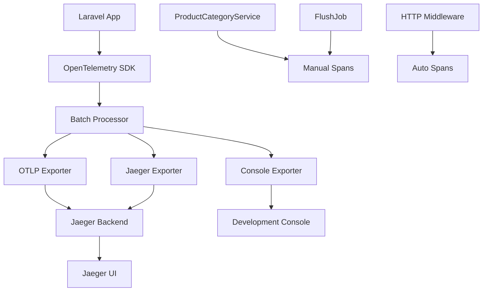

# OpenTelemetry 分散式追蹤設定指南

本文檔說明如何在商品分類模組中配置和使用 OpenTelemetry 分散式追蹤系統。

## 📋 目錄

- [系統架構](#系統架構)
- [安裝配置](#安裝配置)
- [手動追蹤](#手動追蹤)
- [部署設定](#部署設定)
- [效能最佳化](#效能最佳化)
- [故障排除](#故障排除)

## 🏗️ 系統架構



## 🔧 安裝配置

### 1. 環境變數設定

在 `.env` 檔案中添加 OpenTelemetry 配置：

```bash
# OpenTelemetry 基礎配置
OTEL_ENABLED=true
OTEL_SERVICE_NAME="product-category-api"
OTEL_SERVICE_VERSION="2.0.0"
OTEL_DEPLOYMENT_ENVIRONMENT="production"

# OTLP 輸出器配置
OTEL_EXPORTER_TYPE="otlp"
OTEL_EXPORTER_OTLP_ENDPOINT="http://jaeger:4318/v1/traces"
OTEL_EXPORTER_OTLP_HEADERS_AUTHORIZATION=""

# 效能調校
OTEL_BATCH_SIZE=512
OTEL_TIMEOUT_MS=30000
OTEL_MAX_QUEUE_SIZE=2048
OTEL_MAX_EXPORT_BATCH_SIZE=512
OTEL_SAMPLING_RATIO=1.0
```

### 2. 中介軟體註冊

在 `bootstrap/app.php` 中註冊 HTTP 追蹤中介軟體：

```php
return Application::configure(basePath: dirname(__DIR__))
    ->withRouting(
        web: __DIR__.'/../routes/web.php',
        api: __DIR__.'/../routes/api.php',
        commands: __DIR__.'/../routes/console.php',
        health: '/up',
    )
    ->withMiddleware(function (Middleware $middleware) {
        // 全域 HTTP 追蹤中介軟體
        $middleware->web(append: [
            \App\Http\Middleware\OpenTelemetryMiddleware::class,
        ]);
        
        $middleware->api(append: [
            \App\Http\Middleware\OpenTelemetryMiddleware::class,
        ]);
    })
    ->create();
```

### 3. 套件安裝

```bash
# 安裝 OpenTelemetry 核心套件
composer require \
    open-telemetry/opentelemetry \
    open-telemetry/sdk \
    open-telemetry/auto-laravel \
    open-telemetry/exporter-otlp \
    open-telemetry/exporter-jaeger
```

## 🎯 手動追蹤

### ProductCategoryService 中的手動 Span

```php
public function getTree(array $options = []): Collection
{
    $tracer = \OpenTelemetry\API\Globals::tracerProvider()
        ->getTracer('product-category-service');
    
    $span = $tracer->spanBuilder('ProductCategory.getTree')
        ->setSpanKind(\OpenTelemetry\API\Trace\SpanKind::KIND_INTERNAL)
        ->setAttribute('service.name', 'product-category')
        ->setAttribute('operation.name', 'getTree')
        ->startSpan();
    
    $scope = $span->activate();
    
    try {
        // 業務邏輯...
        $span->setAttributes([
            'tree.root_id' => $options['root_id'],
            'tree.max_depth' => $options['max_depth'],
            'cache.hit' => $cached !== null,
        ]);
        
        return $result;
        
    } catch (\Throwable $e) {
        $span->recordException($e);
        $span->setStatus(StatusCode::STATUS_ERROR, $e->getMessage());
        throw $e;
        
    } finally {
        $span->end();
        $scope->detach();
    }
}
```

### FlushJob 中的追蹤

```php
public function handle(ProductCategoryCacheService $cacheService): void
{
    $tracer = \OpenTelemetry\API\Globals::tracerProvider()
        ->getTracer('product-category-jobs');
    
    $span = $tracer->spanBuilder('ProductCategory.FlushCacheJob')
        ->setSpanKind(\OpenTelemetry\API\Trace\SpanKind::KIND_INTERNAL)
        ->setAttribute('job.name', 'FlushProductCategoryCacheJob')
        ->setAttribute('job.id', $this->job?->getJobId() ?? 'unknown')
        ->startSpan();
    
    // 執行快取清除邏輯...
}
```

## 🚀 部署設定

### Docker Compose 範例

```yaml
# docker-compose.yml
version: '3.8'

services:
  laravel:
    build: .
    environment:
      - OTEL_ENABLED=true
      - OTEL_EXPORTER_OTLP_ENDPOINT=http://jaeger:4318/v1/traces
    depends_on:
      - jaeger

  jaeger:
    image: jaegertracing/all-in-one:1.50
    ports:
      - "16686:16686"   # Jaeger UI
      - "14268:14268"   # Jaeger HTTP Thrift
      - "4317:4317"     # OTLP gRPC
      - "4318:4318"     # OTLP HTTP
    environment:
      - COLLECTOR_OTLP_ENABLED=true
```

### Kubernetes 部署

```yaml
# k8s-deployment.yml
apiVersion: apps/v1
kind: Deployment
metadata:
  name: product-category-api
spec:
  template:
    spec:
      containers:
      - name: app
        image: product-category-api:latest
        env:
        - name: OTEL_ENABLED
          value: "true"
        - name: OTEL_EXPORTER_OTLP_ENDPOINT
          value: "http://jaeger-collector:4318/v1/traces"
        - name: OTEL_SERVICE_NAME
          value: "product-category-api"
        - name: OTEL_DEPLOYMENT_ENVIRONMENT
          valueFrom:
            fieldRef:
              fieldPath: metadata.namespace
```

## ⚡ 效能最佳化

### 1. 取樣配置

```bash
# 生產環境建議取樣率
OTEL_SAMPLING_RATIO=0.1  # 10% 取樣

# 高流量 API 可調低取樣率
OTEL_SAMPLING_RATIO=0.01  # 1% 取樣
```

### 2. 批次處理優化

```bash
# 高流量環境優化
OTEL_BATCH_SIZE=1024
OTEL_MAX_QUEUE_SIZE=4096
OTEL_TIMEOUT_MS=15000
```

### 3. 記憶體使用監控

```php
// 在 span 中記錄記憶體使用
$span->setAttributes([
    'memory.start_mb' => round(memory_get_usage(true) / 1024 / 1024, 2),
    'memory.peak_mb' => round(memory_get_peak_usage(true) / 1024 / 1024, 2),
]);
```

## 🔍 監控指標

### Jaeger UI 查詢範例

```
# 查詢快取相關操作
service:product-category-service operation:ProductCategory.getTree

# 查詢失敗的快取清除 Job
service:product-category-jobs error:true

# 查詢超過 1 秒的慢查詢
service:product-category-service min-duration:1s

# 查詢特定使用者的請求鏈路
user.id:12345
```

### 自訂儀表板指標

透過 OpenTelemetry 屬性可以建立以下監控面板：

1. **API 效能監控**：
   - 請求延遲分佈
   - 錯誤率趨勢
   - 吞吐量統計

2. **快取效能監控**：
   - 快取命中率
   - 快取清除頻率
   - 快取操作延遲

3. **背景任務監控**：
   - Job 執行時間
   - Job 失敗率
   - 隊列積壓情況

## 🐛 故障排除

### 常見問題

#### 1. Span 未顯示在 Jaeger

**檢查項目**：
```bash
# 檢查 OpenTelemetry 是否啟用
php artisan tinker
>>> config('services.opentelemetry.enabled')

# 檢查輸出器連線
curl -X POST http://jaeger:4318/v1/traces \
  -H "Content-Type: application/json" \
  -d '{"test": "connectivity"}'
```

#### 2. 記憶體使用過高

**解決方案**：
```bash
# 調整批次大小
OTEL_BATCH_SIZE=256
OTEL_MAX_QUEUE_SIZE=1024

# 降低取樣率
OTEL_SAMPLING_RATIO=0.05
```

#### 3. Span 建立失敗

**除錯模式**：
```php
// 啟用除錯日誌
\OpenTelemetry\SDK\Common\Environment\Variables::OTEL_LOG_LEVEL = 'debug';
```

### 日誌分析

```bash
# 查詢 OpenTelemetry 相關日誌
tail -f storage/logs/laravel.log | grep -i "opentelemetry\|span\|trace"

# 查詢快取清除 Job 追蹤日誌
tail -f storage/logs/laravel.log | grep "FlushProductCategoryCacheJob"
```

## 📊 最佳實務

### 1. Span 命名規範

- **服務操作**：`ServiceName.MethodName`
- **HTTP 請求**：`HTTP GET /api/product-categories`
- **背景任務**：`JobName.handle`
- **資料庫查詢**：`DB.table_name.operation`

### 2. 屬性設定指南

- **必要屬性**：`service.name`, `operation.name`
- **業務屬性**：`user.id`, `category.id`, `cache.key`
- **效能屬性**：`duration_ms`, `memory_mb`, `db.query_count`
- **錯誤屬性**：`error.type`, `error.message`, `error.code`

### 3. 取樣策略

- **開發環境**：100% 取樣 (`OTEL_SAMPLING_RATIO=1.0`)
- **測試環境**：50% 取樣 (`OTEL_SAMPLING_RATIO=0.5`)
- **生產環境**：5-10% 取樣 (`OTEL_SAMPLING_RATIO=0.05`)
- **關鍵路徑**：手動強制取樣

## 📈 擴展計畫

### Phase 3 增強功能

1. **自動註解檢測**：
   - 使用 `@Trace` 註解自動建立 span
   - 支援方法級別的自動追蹤

2. **相關性追蹤**：
   - 跨服務請求關聯
   - 使用者會話追蹤

3. **AI 驅動分析**：
   - 異常模式檢測
   - 效能瓶頸自動識別

---

> 💡 **提示**: OpenTelemetry 是可觀測性的重要基石，結合 Prometheus 指標和結構化日誌，可以建立完整的系統監控體系。
> 
> 📚 **參考資源**: [OpenTelemetry PHP 官方文檔](https://opentelemetry.io/docs/instrumentation/php/) 